# Precursor Scientific Calculator

**Two ways of thinking. One machine that honors both.**

```
"There are two ways to write mathematics.
Algebraic notation mirrors how we speak: two plus three times four.
Reverse Polish mirrors how machines evaluate: push, push, operate.
Most calculators force you to think one way.
This one adapts to how YOU think."
```

---

## What This Is

Precursor Scientific Calculator is a full-featured scientific calculator for [Precursor](https://precursor.dev) — bunnie Huang's open-source, auditable secure computing handheld. It runs on the [Xous](https://github.com/betrusted-io/xous-core) microkernel OS. It supports both algebraic (infix) and RPN (Reverse Polish Notation) evaluation modes, 20+ scientific functions, memory registers, angle mode selection, number base conversion, and persistent settings.

This is not a toy. It is a TI-85 competitor built from scratch in Rust, running on a 100 MHz RISC-V processor with a 1-bit monochrome display and a physical keyboard. Every calculation uses 64-bit floating point. Every expression is parsed with a proper shunting-yard algorithm. Every setting persists to encrypted storage across reboots.

---

## Why This Project

In 1972, Hewlett-Packard released the HP-35 — the first handheld scientific calculator. It used Reverse Polish Notation, a postfix evaluation scheme that eliminated the need for parentheses by making the operator stack explicit. Engineers loved it. It matched how they thought about computation: push operands, apply operations, read results. No ambiguity. No precedence rules. No hidden state.

Texas Instruments took the other path. The TI series used algebraic notation — infix expressions with operator precedence, the way mathematics is written on paper. Students loved it. It matched how they thought about equations: write the formula as you see it, press equals, get the answer.

For fifty years, the calculator industry treated this as a religious war. You were an HP person or a TI person. RPN or algebraic. Stack or expression. The hardware forced the choice.

This project refuses that framing.

Both notations are correct. They are two views of the same computation. Algebraic notation is how humans write mathematics — it mirrors natural language, with its implicit precedence and nested grouping. RPN is how computers evaluate mathematics — it mirrors the stack, with its explicit ordering and zero ambiguity. A calculator that supports only one is a calculator that tells you how to think.

Precursor Scientific Calculator supports both. Press `M` to toggle. Your mode, your angle units, your number base, and your memory registers persist across sessions in encrypted storage. The calculator adapts to you. You do not adapt to it.

This is the HP tradition, honored on open hardware.

---

## Why Precursor

Precursor is a device built on the premise that you should be able to trust your tools. Its CPU is a 100 MHz VexRISC-V. Its display is 336x536 pixels, 1-bit monochrome. Its keyboard is physical. Its storage is hardware-encrypted. Every piece of silicon is open-source and auditable.

These constraints shape the calculator in ways that matter.

**Physical keyboard means tactile math.** You press real keys. You feel the click of each digit, each operator, each Enter. There is no autocorrect, no predictive text, no invisible touch target. The Precursor keyboard maps naturally to calculator input — digits across the top row, operators on shift layers, function keys for scientific menus. The mapping between thought and action is direct.

**1-bit display forces clean UI design.** No color. No grayscale. No anti-aliasing. Every pixel is black or white. This constraint eliminates visual noise and forces information density. The display shows exactly what you need: the current expression or stack, status indicators for mode and angle units, and function key labels. Nothing else.

**f64 precision on 100 MHz RISC-V.** All arithmetic uses 64-bit floating point — 15-17 significant digits. The Lanczos approximation provides gamma function evaluation for non-integer factorials. Trigonometric functions support degrees, radians, and gradians. The shunting-yard parser handles arbitrary nesting depth with proper operator precedence. This is real computation, not a demonstration.

**PDDB for persistent settings.** The Plausibly Deniable DataBase stores your calculator mode, angle units, number base, and all ten memory registers in hardware-encrypted flash. Your computational preferences survive reboots. They are private by default.

---

## How It Works

### Features

- **Dual Mode Operation**: Standard algebraic (infix) and RPN (Reverse Polish Notation)
- **Full Operator Precedence**: Proper mathematical order of operations with parentheses support
- **Scientific Functions**: sin, cos, tan, asin, acos, atan, sinh, cosh, tanh, ln, log, log2, sqrt, cbrt, exp, abs, floor, ceil, round, factorial
- **4-Level RPN Stack**: Classic HP-style X, Y, Z, T registers with LastX recall
- **Memory Registers**: 10 memory slots (M0-M9) for storing values
- **Angle Modes**: Degrees, Radians, Gradians
- **Number Bases**: Decimal, Hexadecimal, Octal, Binary display
- **History Tape**: View and recall previous calculations
- **Persistent Settings**: Mode, angle, base, and memory saved to PDDB

### Keyboard Controls

#### Basic Keys
| Key | Function |
|-----|----------|
| `0-9` | Digit entry |
| `.` | Decimal point |
| `+` `-` `*` `/` | Basic operators |
| `^` | Power (x^y) |
| `%` | Modulo |
| `(` `)` | Parentheses (algebraic mode) |
| `Enter` / `=` | Execute (algebraic) / Push (RPN) |
| `Backspace` | Delete character |
| `Space` | Clear entry (CLx) |
| `C` | Clear all (AC) |

#### Mode Controls
| Key | Function |
|-----|----------|
| `M` | Toggle ALG/RPN mode |
| `A` | Cycle angle mode (DEG->RAD->GRAD) |
| `B` | Cycle number base (DEC->HEX->OCT->BIN) |

#### RPN-Specific Keys
| Key | Function |
|-----|----------|
| `x` / `X` | Swap X<->Y |
| `r` / `R` | Roll stack down |
| `l` / `L` | Recall LastX |

#### Memory Operations
| Key | Function |
|-----|----------|
| `S` + `0-9` | Store to memory M0-M9 |
| `K` + `0-9` | Recall from memory M0-M9 |

#### Shift Layer (Shift + Key)
| Key | Function |
|-----|----------|
| `Shift+1` | sin |
| `Shift+2` | cos |
| `Shift+3` | tan |
| `Shift+4` | ln |
| `Shift+5` | log |
| `Shift+6` | sqrt |
| `Shift+7` | x-squared |
| `Shift+8` | 1/x |
| `Shift+.` | pi |
| `Shift+e` | e |
| `Shift+-` | Change sign (+/-) |

### Function Menus

Press F1-F4 for function menus, then press 0-9 to select:

- **F1: MATH** -- abs, floor, ceil, round, mod, !, exp, 10^x, x-cubed, cube-root-x
- **F2: TRIG** -- sin, cos, tan, asin, acos, atan, sinh, cosh, tanh
- **F3: MODE** -- Toggle mode, angle, base
- **F4: MEM** -- Memory operations

### Algebraic Mode

Type expressions as you write them. The shunting-yard parser handles operator precedence and parentheses. `2+3*4` evaluates to `14`, not `20`. Wrap in parentheses to override: `(2+3)*4 = 20`. Scientific functions are typed by name or accessed via shift keys and function menus.

### RPN Mode

Classic four-level stack (T, Z, Y, X) with LastX register. Enter operands, then apply operators. `2 Enter 3 +` yields `5`. Stack operations: swap X/Y, roll down, recall last X. No parentheses needed — the stack is the grouping mechanism.

---

## Screenshots

*Captured via headless Renode emulation on macOS ARM64. The Precursor display is 336x536 pixels, 1-bit monochrome.*

### Initial State
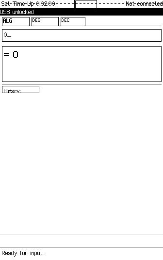

*Clean algebraic mode interface with status indicators and function key menu*

---

### Operator Precedence

| Expression Entry | Result |
|------------------|--------|
|  | 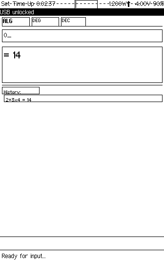 |

**2+3x4 = 14** -- Not 20! Proper mathematical order of operations.

---

### Trigonometric Functions

| Input | Result |
|-------|--------|
|  | 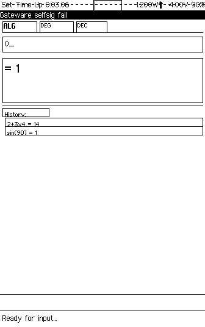 |

**sin(90) = 1** in degree mode. Full trig support with configurable angle units.

---

### Square Root

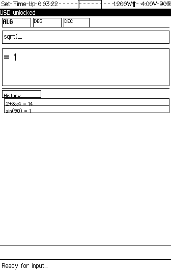

**sqrt(2) = 1.41421356...** -- Type function names directly in algebraic mode.

---

### Parentheses Support

| Expression | Result |
|------------|--------|
|  | 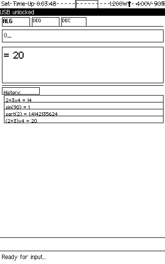 |

**(2+3)x4 = 20** -- Override precedence with parentheses.

---

### RPN Mode

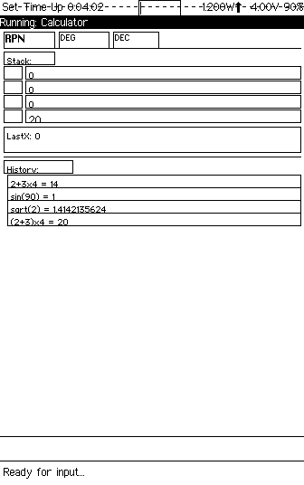

*Classic 4-level stack display (T, Z, Y, X) with LastX register*

---

### RPN Stack Operations

| Enter 2 | Push to stack | Enter 3 | Add = 5 |
|---------|---------------|---------|---------|
| 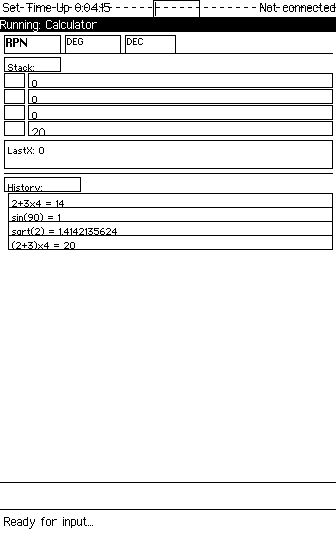 | 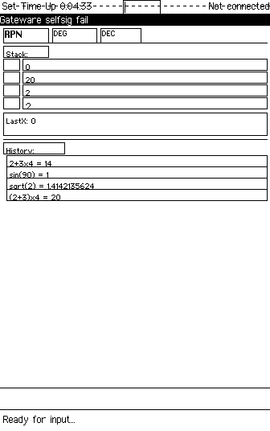 | 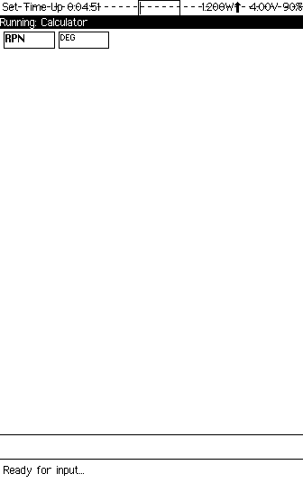 | 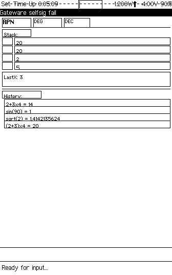 |

**2 Enter 3 + = 5** -- Classic HP-style postfix calculation.

---

### Complex RPN Calculations

| Stack with values | sqrt result |
|-------------------|-------------|
|  | 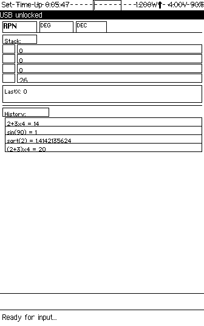 |

*Stack operations with scientific functions*

---

### Angle Modes

| Radians Mode (RPN) | Radians Mode (ALG) |
|--------------------|---------------------|
|  | 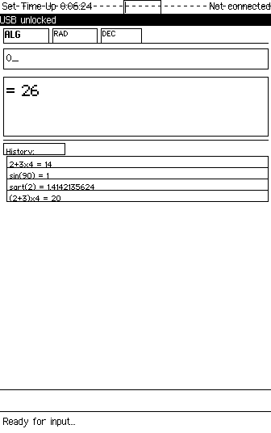 |

*Toggle between DEG, RAD, and GRAD with the 'A' key*

---

### Memory Operations

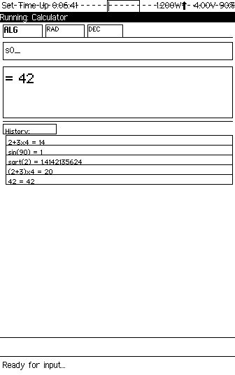

*10 memory registers (M0-M9) -- Store with S+digit, Recall with K+digit*

---

### Number Base Conversion

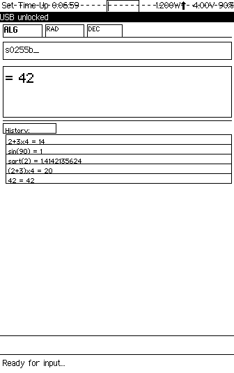

*Cycle through DEC, HEX, OCT, BIN display modes with 'B' key*

---

## Technical Architecture

```
apps/calc/
├── Cargo.toml       # Dependencies: xous, gam, pddb, ticktimer, libm, serde
└── src/
    ├── main.rs      # Entry point, event loop, GAM registration
    ├── app.rs       # Calculator state machine, input dispatch
    ├── algebraic.rs # Shunting-yard parser, tokenizer, infix evaluator
    ├── rpn.rs       # 4-level stack (T/Z/Y/X), LastX, stack operations
    ├── display.rs   # Screen layout, number formatting, scientific notation
    ├── functions.rs # 20+ scientific functions, angle conversion, gamma/factorial
    ├── keymap.rs    # Physical key mapping, shift layer, function menu dispatch
    ├── memory.rs    # 10-register memory bank (M0-M9)
    ├── storage.rs   # PDDB persistence for settings and memory
    └── ui.rs        # Status bar, function key labels, mode indicators
```

### Design Decisions

**Chat UX with raw keys** (`UxType::Chat`): The calculator registers for raw keyboard input rather than using the GAM's text input pipeline. Every keypress is intercepted and interpreted by the calculator's own keymap module. This gives full control over shift layers, function menus, and mode-specific key behavior.

**Shunting-yard parser**: Algebraic mode uses Dijkstra's shunting-yard algorithm to convert infix expressions to postfix for evaluation. This handles operator precedence (multiplication before addition), associativity (left-to-right for arithmetic, right-to-left for exponentiation), nested parentheses, and unary functions. The parser tokenizes the input string, converts to postfix, then evaluates the postfix token stream against a value stack.

**f64 arithmetic throughout**: All calculations use 64-bit floating point. The `libm` crate provides mathematical functions that work in `no_std` environments. Scientific notation formatting handles values outside the comfortable display range.

**Lanczos gamma approximation**: Non-integer factorials use the identity `n! = Gamma(n+1)`. The gamma function is computed via the Lanczos approximation with reflection formula for negative arguments. Integer factorials up to reasonable bounds use direct multiplication for exact results.

**Modular single-crate design**: Rather than splitting into multiple Xous services, the calculator is a single process with clean module boundaries. The algebraic parser, RPN stack, function library, display renderer, and storage layer are independent modules coordinated by the app state machine. This avoids IPC overhead for what is fundamentally a single-user, single-task application.

### PDDB Storage Layout

Settings and memory registers are persisted to the `calc.settings` dictionary in PDDB:

| Key | Contents | Persistence |
|-----|----------|-------------|
| Mode | ALG or RPN | Across reboots |
| Angle | DEG, RAD, or GRAD | Across reboots |
| Base | DEC, HEX, OCT, or BIN | Across reboots |
| Memory | 10 f64 values (M0-M9) | Across reboots |

Serialized as JSON via serde. Total footprint is negligible.

### Dependencies

```toml
[dependencies]
xous = "0.9.69"
xous-ipc = "0.10.9"
gam = { path = "../../services/gam" }
pddb = { path = "../../services/pddb" }
ticktimer-server = { package = "xous-api-ticktimer", version = "0.9.68" }
log-server = { package = "xous-api-log", version = "0.1.68" }
xous-names = { package = "xous-api-names", version = "0.9.70" }
num-derive = { version = "0.4.2", default-features = false }
num-traits = { version = "0.2.14", default-features = false }
serde = { version = "1.0", default-features = false, features = ["derive", "alloc"] }
serde_json = { version = "1.0", default-features = false, features = ["alloc"] }
libm = "0.2"
log = "0.4.14"
```

---

## Building

Precursor Scientific Calculator is a Xous app. It builds as part of the [xous-core](https://github.com/betrusted-io/xous-core) workspace.

### Integration

1. Copy `src/` and `Cargo.toml` to `xous-core/apps/calc/`

2. Add to workspace `Cargo.toml`:
   ```toml
   "apps/calc",
   ```

3. Add to `apps/manifest.json`:
   ```json
   "calc": {
       "context_name": "Calculator",
       "menu_name": {
           "appmenu.calc": {
               "en": "Calculator",
               "en-tts": "Calculator"
           }
       }
   }
   ```

4. Build for Renode emulator:
   ```bash
   cargo xtask renode-image calc
   ```

5. Build for hardware:
   ```bash
   cargo xtask app-image calc
   ```

---

## Technical Notes

- All calculations use 64-bit floating point (f64)
- Factorial uses Lanczos gamma approximation for non-integers
- Settings are persisted to PDDB dictionary `calc.settings`
- Display supports scientific notation for very large/small numbers
- Non-decimal bases display integers only
- Expression parser uses shunting-yard algorithm for proper precedence

---

## Development
---

This app was developed using the methodology described in [xous-dev-toolkit](https://github.com/tbcolby/xous-dev-toolkit) -- an LLM-assisted approach to Precursor app development on macOS ARM64.

## Author
---

Made by Tyler Colby -- [Colby's Data Movers, LLC](https://colbysdatamovers.com)

Contact: [tyler@colbysdatamovers.com](mailto:tyler@colbysdatamovers.com) | [GitHub Issues](https://github.com/tbcolby/precursor-calc/issues)

## License
---

Licensed under the Apache License, Version 2.0.

See [LICENSE](LICENSE) for the full text.
